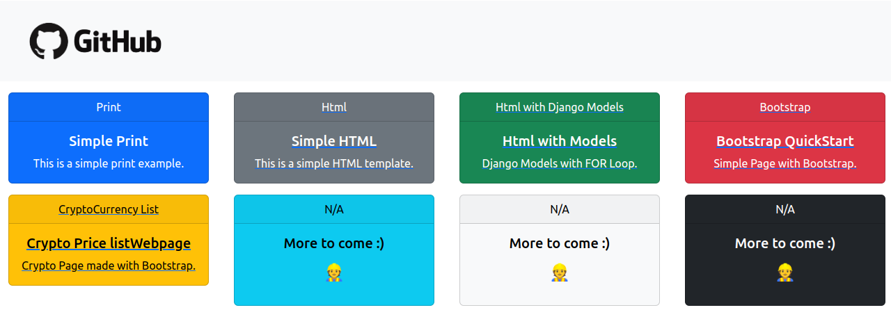

# :zap: Web Automation with Selenium and PyTest

* Web Automation Project using **Selenium** and **Pytest**

  

## :page_facing_up: Table of Contents   

* [:zap: Web Automation with Selenium & PyTest](#zap-web-automation-with-selenium-and-pyTest)
  * [:page_facing_up: Table of contents](#page_facing_up-table-of-contents)
  * [:books: General info](#books-general-info)
  * [:camera: Screenshots](#camera-screenshots)
  * [:signal_strength: Technologies](#signal_strength-technologies)
  * [:floppy_disk: Setup](#floppy_disk-setup)
  * [:computer: Code Examples](#computer-code-examples)
  * [:clipboard: ToDo](#clipboard-todo)
  * [:file_folder: License](#file_folder-license)
  * [:envelope: Contact](#envelope-contact)

## :books: General info

* Django Templates shown on a HTML page

## :camera: Screenshots

## :signal_strength: Technologies

* [Python v3.9](https://www.python.org/)
* [Django v4.1.4](https://www.djangoproject.com/download/)
* Requests v2.28

## :floppy_disk: Setup

* [Install Poetry](https://python-poetry.org/docs/#installation) as Virtual Env
  * create a virtual env with Poetry: `poetry init`
  * access the newly created virtual env: `poetry shell`
* Install Selenium: `poetry add selenium`
* Download and install the appropriate [ChromeDriver](https://chromedriver.chromium.org/downloads)
  * **note**: for Linux the driver shall be placed at: `/usr/local/bin/`
* Install PyTest: `poetry add pytest` 
* Run the automated script: `python download_dataset.py`
 

## :computer: Code Examples

* Run the automated script
  * `python download_dataset.py`

* Run the test script
  * `pytest test_elements.py` 

## :clipboard: ToDo

* ToDo: add new tests and automate different elements

## :file_folder: License

* MIT

## :envelope: Contact

* Get in touch with [Sambiase](https://github.com/sambiase)
* E-mail: [marsamb@gmail.com](mailto:marsamb@gmail.com)